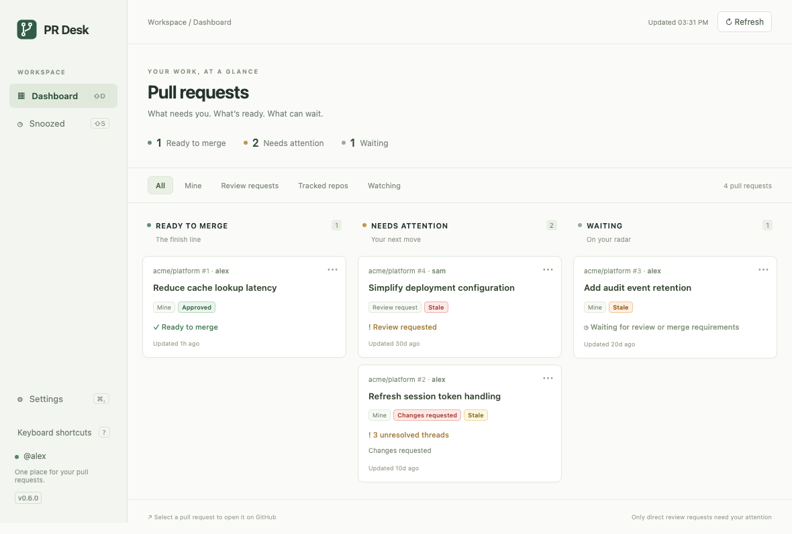

# PR Desk

<p align="center">
  
</p>

A compact macOS pull request dashboard. PR Desk shows what needs your attention, what
is ready to merge, and what can wait. GitHub remains the place to review, comment, and
merge; selecting a card opens the pull request in your default browser.

## Installation

### Prerequisites

PR Desk currently supports Apple Silicon Macs. You will need
[Homebrew](https://brew.sh/) and the [GitHub CLI](https://cli.github.com/) authenticated
with the GitHub.com account whose pull requests you want to see.

```sh
brew install gh
gh auth login --hostname github.com
gh auth status --hostname github.com
```

The final command verifies that authentication is working. The account needs access to
each private organization and repository you want PR Desk to display; if your
organization uses SAML SSO, authorize the GitHub CLI for that organization as well.

### Install with Homebrew

```sh
brew install --cask pablaber/tap/pr-desk
```

Homebrew adds the public
[`pablaber/homebrew-tap`](https://github.com/pablaber/homebrew-tap) and installs
`PR Desk.app` in `/Applications`. Published releases are Developer ID signed and
notarized by Apple.

To upgrade, quit PR Desk and run:

```sh
brew update
brew upgrade --cask pr-desk
```

PR Desk has no in-app updater.

## Key features

- Sorts pull requests into Ready to merge, Needs attention, and Waiting based on
  reviews, required checks, unresolved threads, conflicts, and draft state.
- Combines your own PRs, direct review requests, tracked repositories, and individually
  watched PRs in one dashboard.
- Filters by source and supports snoozing or ignoring PRs and entire repositories.
- Offers configurable automatic refresh while keeping failed refresh results visible
  and clearly marked as stale.
- Stores preferences locally and uses your existing GitHub CLI authentication for
  read-only GitHub access.

## GitHub access

All requests run through the installed authenticated `gh` CLI against GitHub.com:

```text
gh auth status --hostname github.com
gh api --hostname github.com graphql -f query=...
```

PR Desk never handles a GitHub token itself. GraphQL queries fetch:

- `viewer { login }` for the current user.
- Search `is:pr is:open author:@me` for owned PRs.
- Search `is:pr is:open user-review-requested:@me` for **individual** review requests.
- `repository.pullRequests(states: OPEN)` for tracked repositories.
- `repository.pullRequest(number: ...)` for each unique PR, including watched PRs.
- Aggregate `reviewDecision`, `mergeable`, `mergeStateStatus`, draft/state/update
  fields, reviewer requests, review threads, and the latest commit's status-check
  rollup.
- `CheckRun.isRequired(pullRequestNumber: ...)` and `StatusContext.isRequired(...)`
  distinguish required from optional checks. Pending/unknown checks never count as
  passing.

Searches, repository lists, review requests, review threads, and check contexts are
paginated. Only `User` reviewers contribute direct requests; team requests never
trigger attention. GitHub search's 1,000-result ceiling is reported as an error rather
than silently truncating. Detail query failures are reported individually.

References: [GitHub check fields](https://docs.github.com/en/graphql/reference/checks),
[Tauri Store](https://v2.tauri.app/plugin/store/), and
[Tauri Opener](https://v2.tauri.app/plugin/opener/).

## Current limits

- One active GitHub.com account; there is no Enterprise hostname or account selector.
- Detail queries run for each unique PR, so very large dashboards may need additional
  time and API quota.
- GitHub search indexing and mergeability computation can lag. Refresh again to fetch
  updated results.
- Previously loaded cards remain visible and are marked stale when refresh fails;
  inspect GitHub before acting on stale readiness.
- State timestamps use the PR update time as an approximation.

## Development

See [Development](docs/development.md) for local setup and run commands, architecture,
testing, local builds, and release maintenance. Contributors and automated agents
should also read [AGENTS.md](AGENTS.md).
