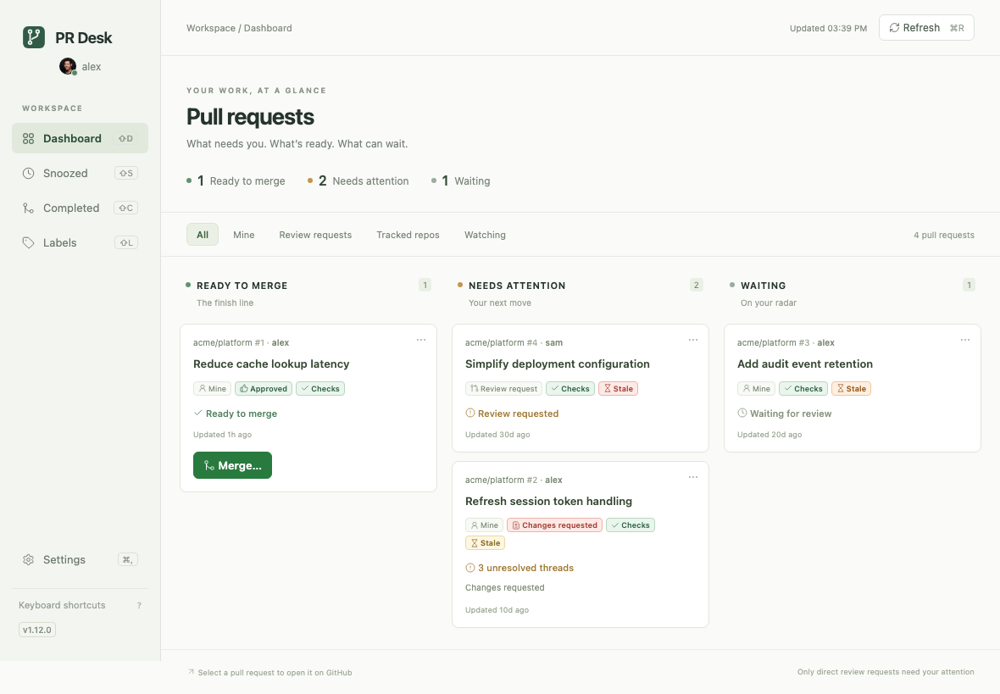

# PR Desk

<p align="center">
  
</p>

A compact macOS pull request dashboard. PR Desk shows what needs your attention, what
is ready to merge, and what can wait. Select a card to review or comment on GitHub. Ready to merge cards for your own PRs and known-bot PRs have a green
**Merge…** button with a confirmation and a choice of squash, merge commit, or rebase.
PR Desk rechecks readiness and the commit before merging through your authenticated
GitHub CLI. Repository permissions and merge rules still apply; repositories requiring
a merge queue may need to be merged on GitHub. Known-bot PRs waiting for your review whose
checks all pass and that GitHub can merge have an **Approve and merge…** button that approves
the confirmed commit, then merges it. Cards with checks carry a Checks badge: green when all pass, amber while any are running, red when any fail.

## Installation

### Prerequisites

PR Desk currently supports Apple Silicon Macs. You will need
[Homebrew](https://brew.sh/) and the [GitHub CLI](https://cli.github.com/) authenticated
with the GitHub.com account whose pull requests you want to see.

```sh
brew install gh
gh auth login --hostname github.com
gh auth status --hostname github.com
```

The final command verifies that authentication is working. The account needs access to
each private organization and repository you want PR Desk to display; if your
organization uses SAML SSO, authorize the GitHub CLI for that organization as well.

### Install with Homebrew

```sh
brew install --cask pablaber/tap/pr-desk
```

Homebrew adds the public
[`pablaber/homebrew-tap`](https://github.com/pablaber/homebrew-tap) and installs
`PR Desk.app` in `/Applications`. Published releases are Developer ID signed and
notarized by Apple.

To upgrade, quit PR Desk and run:

```sh
brew update
brew upgrade --cask pr-desk
```

PR Desk has no in-app updater.

## Key features

- Sorts pull requests into Ready to merge, Needs attention, and Waiting based on
  reviews, all checks, unresolved threads, conflicts, and draft state. See
  [PR states](docs/pr-states.md) for the full rules.
- Combines your own PRs, direct review requests, tracked repositories, and individually
  watched PRs in one dashboard.
- Acts on the hovered card from the keyboard: O opens the PR on GitHub, S snoozes, L labels
  and I ignores it.
- Filters by source and supports snoozing or individually ignoring PRs. Individually ignored
  PRs are listed under Settings → Ignored pull requests, where each can be unignored.
  Settings → Ignore rules hides PRs by repository, exact author login (including bots), or title. Repository and
  title rules use case-insensitive whole-value globs: `*` matches zero or more characters and
  `?` matches one. For example, `acme/*`, `*/docs`, or title `chore:*`; use `*dependenc*`
  to match text anywhere in a title. Any matching rule hides a PR from every dashboard source.
  Exact repository exclusions still narrow GitHub searches; repository patterns filter before
  detail fetching, and author/title rules use already-fetched details without extra requests.
- Groups PRs with in-app labels (⇧L). Labels exist only in PR Desk — nothing is written to
  GitHub — and show as badges on cards. The Labels screen lists every label with its PR count;
  open one to see its pull requests, and rename, recolor, or delete labels there. A refresh
  automatically drops the label from PRs that were merged, closed, or are no longer tracked,
  and stops watching PRs that were merged or closed.
- Manages known bots (Settings → Known bots, prefilled with Dependabot and Renovate): their PRs in
  tracked repositories sit in Needs attention as "Waiting for your review" like any other PR that
  is not yours, with in-app Approve and merge… once their checks pass; once approved, they and
  watched bot PRs move to Ready to merge (with in-app Merge…); failed checks or conflicts bring them back to Needs attention, and they carry a Bot
  badge. Add a GitHub App as `name[bot]`, such as `renovate[bot]`, or a machine user account by
  its exact login; the author's account type must match.
- Supports per-repository non-blocking check rules (Settings → Non-blocking checks): a matching
  _pending_ check, such as `policy-bot`, no longer keeps an approved PR out of Ready to merge.
  Failures still need attention, and these PRs have no in-app Merge.
- Batches Settings edits: tracked repositories, ignore rules, check rules and watched pull requests are
  collected as a draft — each new repository or PR is checked against GitHub as you add it —
  and only Save writes them and refreshes the dashboard, in the background. Closing Settings
  with unsaved changes asks whether to save, discard, or keep editing.
- Opens Settings (⌘,) as a full-window overlay with a sidebar of sections; Esc closes it.
- Offers configurable automatic refresh while keeping failed refresh results visible
  and clearly marked as stale.
- Shows a Dock icon badge counting Ready to merge, Needs attention, or both (the default);
  choose Off in Settings to hide it.
- Exports your configuration to the clipboard as JSON and imports it from pasted text or a
  `.json` file (Settings → Import & export); importing replaces the configuration after a
  confirmation, and leaves snoozes, ignored PRs and label assignments alone.
- Copies debug info as JSON (Settings → Troubleshooting for the whole board, or a card's menu
  for one PR): each PR's normalized GitHub state, matched dashboard rules, derived signals and
  why it landed in its column or was hidden, alongside preferences, refresh warnings and the
  errors seen since launch — ready to paste into an issue or a coding agent. Settings →
  Troubleshooting also lists this session's errors, each with its own copy button.
- Opens a card's menu on right-click as well as from its ⋯ button.
- Stores preferences locally and uses your existing GitHub CLI authentication.
- Closes PRs with red staleness (over 28 days) after confirmation, leaving an automated
  comment with their inactivity in days. Enter confirms; Escape cancels.

## GitHub access

All requests run through the installed authenticated `gh` CLI against GitHub.com:

```text
gh auth status --hostname github.com
gh api --hostname github.com graphql -f query=...
```

PR Desk never handles a GitHub token itself. GraphQL queries fetch:

- `viewer { login }` for the current user.
- Search `is:pr is:open author:@me` for owned PRs.
- Search `is:pr is:open user-review-requested:@me` for **individual** review requests.
- `repository.pullRequests(states: OPEN)` for tracked repositories.
- `repository.pullRequest(number: ...)` for missing connection pages and PRs absent from
  discovery (watched PRs or IDs retained from failed sources).
- Aggregate `reviewDecision`, `mergeable`, `mergeStateStatus`, draft/state/update
  fields, reviewer requests, review threads, and the latest commit's status-check
  rollup.
- Every check contributes to status. Pending/unknown checks never count as passing;
  success, neutral, and skipped checks pass. Empty check sets also pass. PR Desk can
  withhold readiness when GitHub permits merging because an optional check failed.

Searches, repository lists, review requests, review threads, and check contexts are
paginated. Complete discovery records need no detail request. Refresh finishes all
fetching before publishing one snapshot; existing cards remain visible until then.
Only `User` reviewers contribute direct requests; team requests never
trigger attention. GitHub search's 1,000-result ceiling is reported as an error rather
than silently truncating. Detail query failures are reported individually.

References: [GitHub check fields](https://docs.github.com/en/graphql/reference/checks),
[Tauri Store](https://v2.tauri.app/plugin/store/), and
[Tauri Opener](https://v2.tauri.app/plugin/opener/).

## Current limits

- One active GitHub.com account; there is no Enterprise hostname or account selector.
- Discovery includes complete card fields. Large dashboards with paginated nested
  connections still need additional time and API quota.
- GitHub search indexing and mergeability computation can lag. Refresh again to fetch
  updated results.
- Previously loaded cards remain visible and are marked stale when refresh fails;
  inspect GitHub before acting on stale readiness.
- State timestamps use the PR update time as an approximation.

## Development

See [Development](docs/development.md) for local setup and run commands, architecture,
testing, local builds, and release maintenance. Contributors and automated agents
should also read [AGENTS.md](AGENTS.md).
